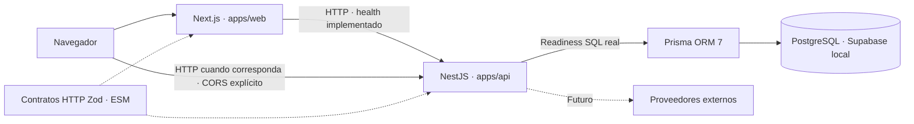

# Arquitectura

Dos aplicaciones independientes comparten únicamente contratos HTTP y opciones TypeScript. pnpm gestiona dependencias y Turbo ordena sus tareas; Nest permanece en modo estándar dentro de `apps/api`.

## Implementado

- Web conserva App Router, página temporal, Server Components y pruebas originales. `/system-status` es una ruta técnica sin indexación y fuera de navegación comercial.
- La ruta llama `connection()` antes de leer configuración privada o hacer HTTP. El build no requiere API viva. `fetchHealth` usa timeout de 3 segundos, `no-store`, rechazo de respuestas HTTP fallidas y validación Zod.
- `config/public.ts` solo lee `NEXT_PUBLIC_API_BASE_URL`. `config/server.ts` usa `server-only` y solo lee `API_INTERNAL_BASE_URL`. El cliente fetch no importa configuración privada. `fetchBrowserHealth` usa exclusivamente el getter público.
- Nest expone `GET /api/v1/health` mediante HealthModule, HealthController y HealthService inyectado. Respuesta: `{"status":"ok","service":"distrito-hobby-api"}`. Es **liveness** del proceso, no readiness de PostgreSQL o terceros.
- Configuración Zod, Helmet, CORS de orígenes explícitos, errores públicos uniformes y cierre ante SIGTERM/SIGINT. Los logs contienen eventos de arranque y códigos de fallo; no cuerpos, URLs con query, cookies, contraseñas ni datos de clientes.
- CORS usa una lista exacta, métodos GET/HEAD/OPTIONS y no habilita credenciales. Un origen no permitido no recibe autorización CORS; el endpoint público puede responder a clientes HTTP fuera del navegador. CORS no sustituye autenticación ni autorización.

## Límites y compilación

`@distrito/contracts` exporta los esquemas Zod y tipos HTTP de health/readiness. Su build produce JavaScript ESM y declaraciones en `dist`; los consumidores importan el nombre del paquete, con `workspace:*`. No se publican modelos de base de datos ni configuración del servidor.

API y contratos usan `type: module`, `module: NodeNext` y `moduleResolution: NodeNext`. Los imports relativos del backend llevan extensión `.js` para que el JavaScript compilado resuelva en Node. Nest usa `experimentalDecorators` y `emitDecoratorMetadata`; su build con tsc conserva metadata. Vitest usa SWC con decoradores heredados y metadata explícita, según la [receta oficial de Nest](https://docs.nestjs.com/recipes/swc#vitest). La prueba de integración usa el servicio real y detecta si su constructor deja de inyectarse.

Next mantiene bundler/JSX, sus plugins y `noEmit` propios; ninguna de esas opciones se hereda en API. Turbo construye contratos mediante `^build` antes de sus consumidores. `turbo watch` reconstruye dependencias y permite reiniciar los servidores al cambiar los contratos; los watchers de Next/Nest manejan sus fuentes propias.

`pnpm lint` incluye una comprobación AST de imports: web no puede importar API, Prisma ni Better Auth servidor; contratos no pueden importar apps, módulos Node, React, Nest ni entorno. Los imports relativos tampoco pueden escapar de su paquete. Las dependencias runtime de contratos se limitan a Zod. Si se añade un export cliente de Better Auth en otra fase, debe añadirse una excepción explícita y acotada, sin permitir el servidor.

## Responsabilidades futuras

Next presenta la interfaz y podrá hacer SSR. Cualquier proxy/BFF se limitará a transporte y sesión. **Nest será la autoridad** de precios finales, disponibilidad, permisos, operaciones de stock, validación de pagos y servicios externos. Ni el estado del navegador ni una redirección de pago serán prueba suficiente de pago. Callbacks y webhooks de proveedores terminarán en Nest.

Prisma/client/adapter-pg permanecen en 7.10.0 exclusivamente en API. El esquema sin modelos vive en `apps/api/prisma/`; Turbo genera ESM antes de compilar. DatabaseModule consulta PostgreSQL local para `/api/v1/ready` (200/503); `/health` sigue independiente. Supabase gestiona infraestructura y Prisma Migrate será el único dueño de las tablas comerciales del esquema app. No hay modelos comerciales ni accesos DB desde Next. Ver [desarrollo local](local-development.md).

Better Auth permanece instalado en API sin instancia, sesiones ni adaptador. Quedan por decidir cookies, dominio/orígenes, SameSite, transporte del cliente y protección CSRF. No hay JWT casero ni tokens de sesión en localStorage.

## Hoja de ruta diferida

1. **MVP:** catálogo, disponibilidad real, carrito, checkout invitado, costo de envío visible antes del checkout, pedidos, enlaces de WhatsApp y administración básica.
2. **Después:** cuentas opcionales, historial, direcciones y repetir compra.
3. **Más adelante:** puntos con tasas independientes de acumulación y canje.

Estas capacidades no están implementadas. BAC es una opción de pago por evaluar, no una decisión ni integración confirmada. No se instala Stripe, WhatsApp Cloud API, Redis, BullMQ, GraphQL, microservicios ni PWA. Tampoco se construyen pantallas de mockups ni se cambia la identidad aprobada para después.
